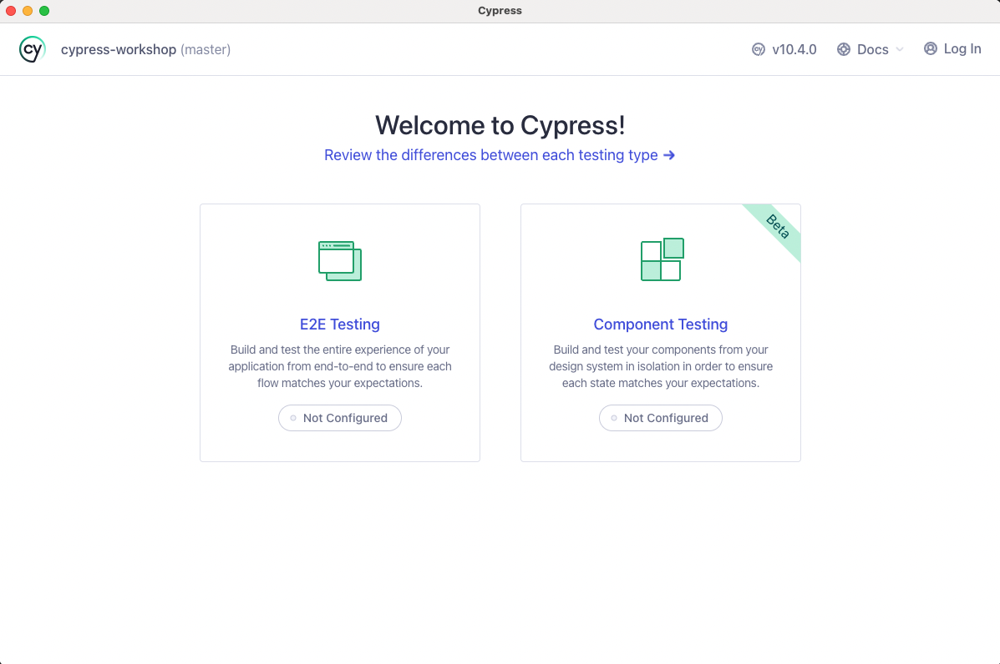
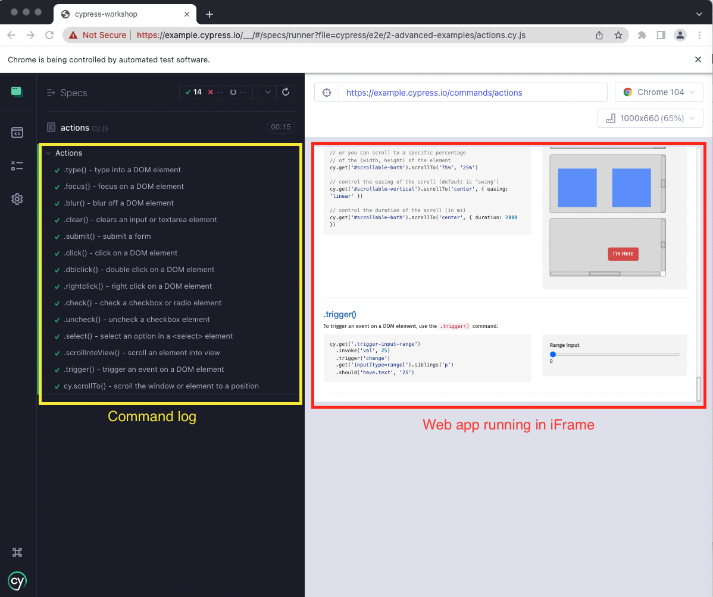

# Exercise 1 - Initial run of Cypress

### Opening the Cypress runner

There is a script in our `package.json` file that I have created to open the Cypress Test Runner.


Try it now by running the following: 

```sh 
$ npm run cy:open
```

After some initially load time, the Cypress app should now be available. 



> The Cypress team have recently added Component Testing into the product, but is currently in beta mode.

At Pod Point we use Cypress for E2E (end to end) testing. Select this option to proceed. Cypress will then outline the configurations that it has automatically generated within your workspace. 

 Compatible web browsers on your machine will be automatically detected. (Chromium based browsers only)

Pick your browser of choice and continue.

You will be given the option to create a new empty spec (a test file) or have Cypress scaffold examples specs. Select scaffold  so we can play with some examples. 

Cypress has now added an 'e2e' directory in your workspace containing a collection of examples of Cypress in action

> Older versions of Cypress named this directory 'integration' but this term was overloaded in the industry so was updated to e2e to better reflect Cypress' primary use case.

The 'Test Runner' will now open in your browser of choice.


 ### Exercise

 From within the Cypress test runner, run the `actions.cy.js` automated tests by clicking on them. 

 > The default examples provided are created to run on a demo 'Kitchen Sink' web application created by the Cypress team `https://example.cypress.io`



The Command log outlines the actions taken by the running test (more on this later). 

The web application under test is displayed in an iFrame within the Runner.

### Task 
Once you have successfully seen the actions tests run, try running them again but this time on a different web browser.