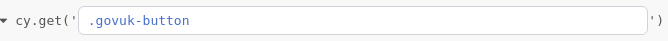

# Exercise 4 - Interacting with page elements

We will continue the happy path journey of our fake service by clicking on the 'Start now' link:

### Exercise

In the Cypress Test Runner toggle on the `Open Selector Playground` via the icon that looks like a target:

With the Playground Selector active, select the `Start now` link that is styled like a button.

You'll notice that the runner suggests you can interact with the element via `cy.get('.govuk-button')`:

Click on the copy to clipboard button located on the right hand side of the menu in the Cypress runner:

In our `journey_test.cy.js` file paste this action after our visit command.

We can interact with DOM elements by chaining Cypress functions. The `click` function can be called on our selected element:

`cy.get('.govuk-button').click();`

Try adding the click function call to your `journey_test.cy.js` file. 

### Conclusion

Take a moment to inspect the Command Log in the Test Runner after your changes to your test script. You are able to time travel through the test and see the state of the application at each step by simply hovering your cursor over each step in the Command Log.

Notice that Cypress highlights the link it finds and indicates where it clicks. It shows the new page load occuring and the new url for the 'geese-liked' page we navigate to.

Cypress does this by taking automatic snapshots of the app under tests as it runs.
